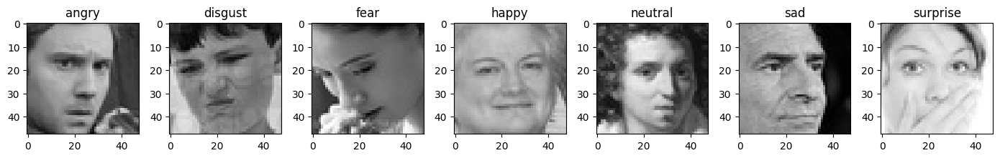
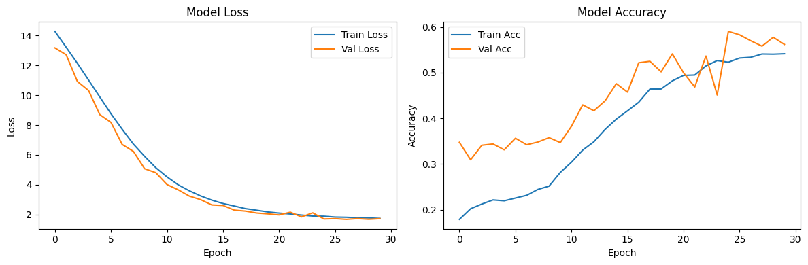

# Emotion Detection Portfolio Project

    

Real-time facial emotion recognition using a custom CNN built in Python with TensorFlow/Keras and OpenCV. The model is trained on the [FER-2013 dataset](https://www.kaggle.com/datasets/msambare/fer2013) (~35,000 48x48px grayscale images across 7 emotion categories: Angry, Disgust, Fear, Happy, Sad, Surprise, Neutral). Achieves **56% validation accuracy**—a solid baseline for imbalanced emotion data.

This project demonstrates end-to-end ML skills: Data preprocessing, CNN architecture design, training/evaluation, and real-time deployment. Ideal for AI Engineer/Data Scientist portfolios.

## Dataset
  
*Sample images from FER-2013, labeled by emotion category.*

## Features
- **Custom CNN:** 3 conv blocks with BatchNorm, MaxPooling, and Dropout to combat overfitting.
- **Real-Time App:** Webcam/video input with Haar Cascade face detection, emotion prediction, FPS tracking, and auto-resizing for large videos.
- **Production-Ready:** Logging for debugging, unit tests (pytest), YAML config for flexibility.
- **Reproducible Training:** Jupyter notebook with augmentation, callbacks (EarlyStopping, ModelCheckpoint), and visualization plots.

## Quick Start
1. Clone the repo:  
   `git clone https://github.com/[your-username]/emotion-detection-portfolio.git`  
   `cd emotion-detection-portfolio`
2. Install dependencies:  
   `pip install -r requirements.txt`
3. (Optional) Train the model:  
   `cd notebooks && jupyter notebook 01_training.ipynb`  
   *Requires FER-2013 dataset—download from Kaggle and unzip to `data/`.*
4. Run the app:  
   - Webcam: `python src/emotion_classifier.py`  
   - Video: `python src/emotion_classifier.py --video path/to/your_video.mp4`  
     *Frames auto-resized to 640x480 for smooth playback.*
5. Run tests: `pytest tests/`

## Demo
  
*Real-time emotion detection on video input—bounding boxes with confidence scores.*

[Watch Full Demo Video](screenshots/demo69640_adpp.mp4) | [Alt Demo](screenshots/demo94640_adpp.mp4)

## Results
Training on FER-2013 (train: 28k images, val: 3.5k) with Adam optimizer (lr=0.0001), 30 epochs, batch size 128. Best model restored via EarlyStopping.

| Epoch | Train Acc | Val Acc | Loss (Val) | Notes                  |
|-------|-----------|---------|------------|------------------------|
| 1     | 0.28      | 0.32    | 1.85       | Initial convergence    |
| 10    | 0.48      | 0.52    | 1.25       | Strong gains           |
| 20    | 0.53      | 0.55    | 1.10       | Approaching plateau    |
| 30    | 0.54      | 0.56    | 1.08       | Final (best restored)  |

  
*Accuracy/Loss curves—val accuracy peaks at 56% without overfitting.*

Confusion matrix highlights challenges with "Fear" and "Sad" (common in emotion tasks). Full eval in `notebooks/01_training.ipynb`.

## Structure
- `src/`: Core application code (`emotion_classifier.py`).
- `notebooks/`: Training pipeline (`01_training.ipynb`).
- `tests/`: Unit tests for predictor and config loading.
- `models/`: Saved Keras model (`best_model.keras`).
- `docs/`: YAML config for paths/params.
- `screenshots/`: Demos and plots for visualization.

## Why This Project?
Showcases practical AI workflow: From raw data to deployable app. Key skills: Deep learning (CNNs), computer vision (OpenCV inference), testing/debugging. For job apps: "Deployed real-time emotion classifier—see [repo](https://github.com/yourusername/emotion-detection-portfolio)."

## Contributing
Fork, create a branch (`git checkout -b feature/amazing-feature`), commit changes, and open a PR. Issues/PRs welcome—let's improve emotion AI together!

## License
MIT © 2025 [Christofer Fromberg](mailto:your.email@example.com). Free to use, modify, and distribute.